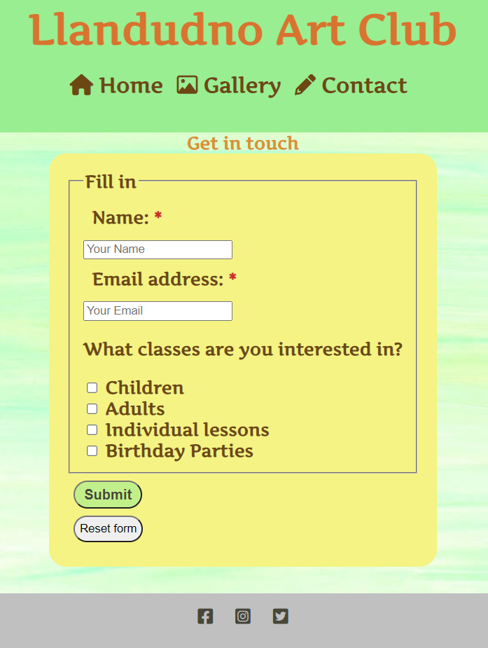

# Llandudno Art Club

Llandudno Art Club website is designed to attract children and adults interested in art. The club is situated in Llandudno, North Wales. It offers art classes to children of different age groups as well as adults and individual lessons. The classes are held in Craig y Don community centre. 

The club also offers various birthday party packages with an art theme (painting, drawing, sculpture, arts and crafts). Birthday parties are held either in the community centre or at the venue of the customers' choice.   


## Wireframes

index.html 


gallery.html 


form.html 


## Features 

### Existing Features

- __Navigation Bar__

  The navigation bar is fully responsive. It is split into two parts. The first part includes links for three pages: Home, Gallery and Contact which are identical and responsive on each page. The second part is included only on the Home page and links a choice of classes to their descriptions situated on the Home page.


- __The landing page image__

  - The landing page offers the choice of art classes available at the Llandudno Club.


- __Timetable Section__

  - The timetable section provides the timetable for all the art classes available at the club. There is aslo a brief overview of the birthday parties options. 


- __Map section__

  - This section shows the users the location of the community centre where the classes take place. 

  


- __The Footer__ 

  - The footer section includes links to the relevant social media sites for the Art Club. The links will open to a new tab to allow easy navigation for the user. 
  


- __Gallery__

  - The gallery contains the pictures of the children's and alults' art created during the lessons in the club.


- __The Contact Page__  

  On the Contact page the users can submit their name and email address and select the classes in which they are interested.




### Features Left to Implement

- Create a logo of the club.
- Pricing for the classes and birthday parties will be included soon.
- The club also has an idea for the future to sell art created by the members (children and adults) if anyone is interested.
- Separate page for the members to log in and view photos, club members' events, blogs.
- Make the web-site bi-lingual English/Welsh.

## Testing

To view all testing documentation please refer to [TESTING.md](TESTING.md)

## Deployment

The site was deployed to GitHub pages. The steps to deploy are as follows: 
  - In the [GitHub repository](https://github.com/OlenaDen/llandudno-art-club), navigate to the Settings tab 
  - From the source section drop-down menu, select the **Main** Branch, then click "Save".
  - The page will be automatically refreshed with a detailed ribbon display to indicate the successful deployment.

The live link can be found [here](https://olenaden.github.io/llandudno-art-club)

### Local Deployment

In order to make a local copy of this project, you can clone it. In your IDE Terminal, type the following command to clone my repository:

- `git clone https://github.com/OlenaDen/llandudno-art-club.git`

Alternatively, if using Gitpod, you can click below to create your own workspace using this repository.

[](https://gitpod.io/#https://github.com/OlenaDen/llandudno-art-club)

## Credits 

### Content 

- The content for the Home page is made up.

-  The building of the website was based on the learning outcome from Code Institute Programme. 

- Part of the code copied from Love Running to style images: 

```css
#photo {
    clear: both;
    line-height: 0;
    column-count: 4;
    column-gap: 0px;

#photo img{
    width: 100%;
}
```

- Part of the code copied from Runnable example CSS-CC-46-complete to style the footer. 

```css
    text-align: center;
    width: 100%;
    position: fixed;
    bottom: 0;
    right: 0;
    z-index: 3;
```

- The code was copied to add br between two nav bars: [Stackoverflow](https://stackoverflow.com/questions/899252/can-you-target-br-with-css)

```css

br
{   content: "A" !important;
    display: block !important;
    margin-bottom: 1.5em !important;
}
```

- The code was copied for 'back to top' https://codepen.io/daveyjh/pen/GRMmqOO

```css

<a href="#top" id="back-to-top"></a> 
#top {
  position: absolute;
  top: 0;
  ```

- The icons in the navigation bar and the footer were taken from [Font Awesome](https://fontawesome.com/)


- Media query was copied from Love Running:

```css

/* For small screens sizes from 800px wide and down */
@media screen and (max-width: 800px){
    #photo{
        column-count: 2;
    }
}
}
```

- Love Running README boilerplate was used for the README.md

### Media

- The photo used on the Home page is taken from [Pixabay](https://pixabay.com/photos/painting-pencils-paint-pens-911804/).

- The background image which was slightly modified to a lighter version and used on all three pages is taken from [Pixabay] (https://pixabay.com/illustrations/background-texture-abstract-art-6556409/) 

- The images used for the Gallery page are the author's family and friends' creations.


