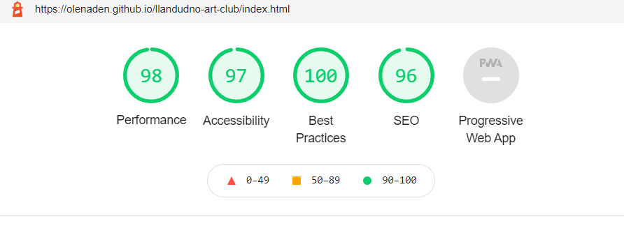
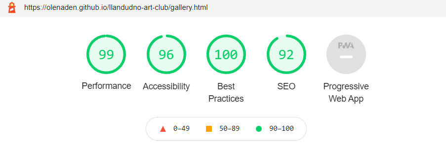
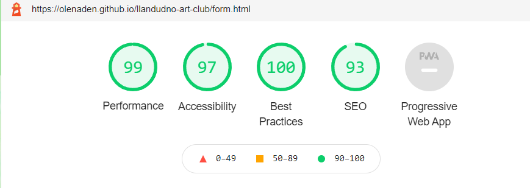
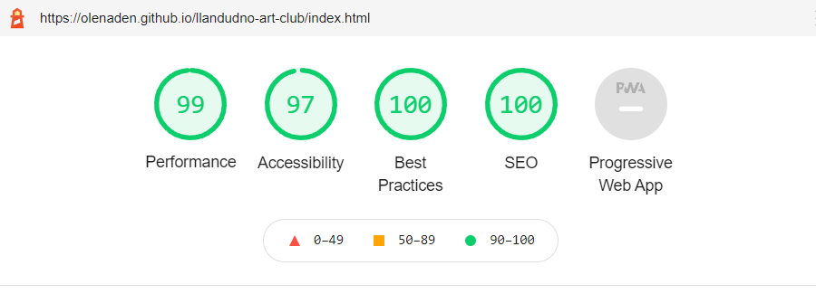
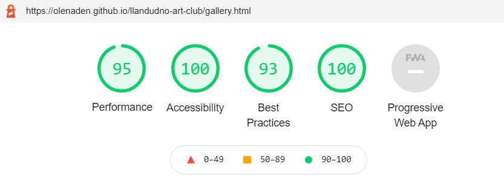
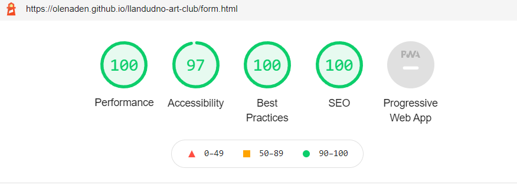
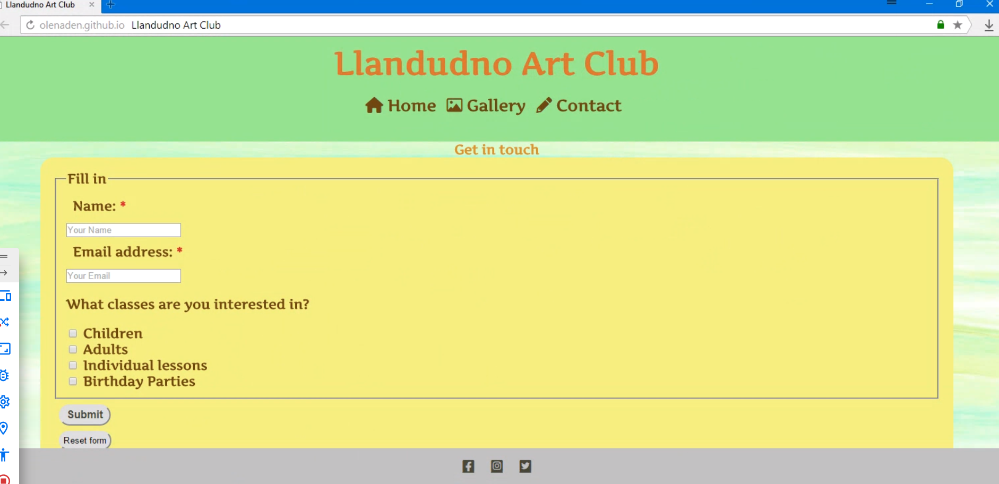
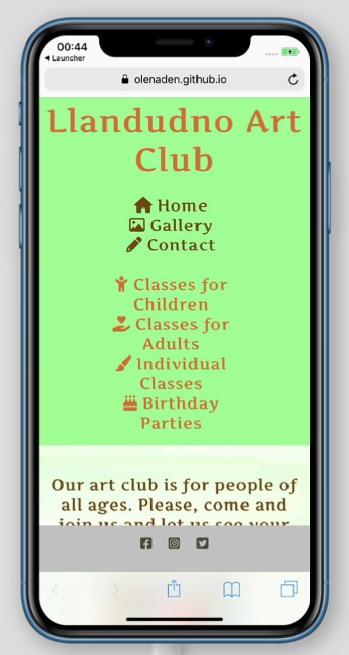
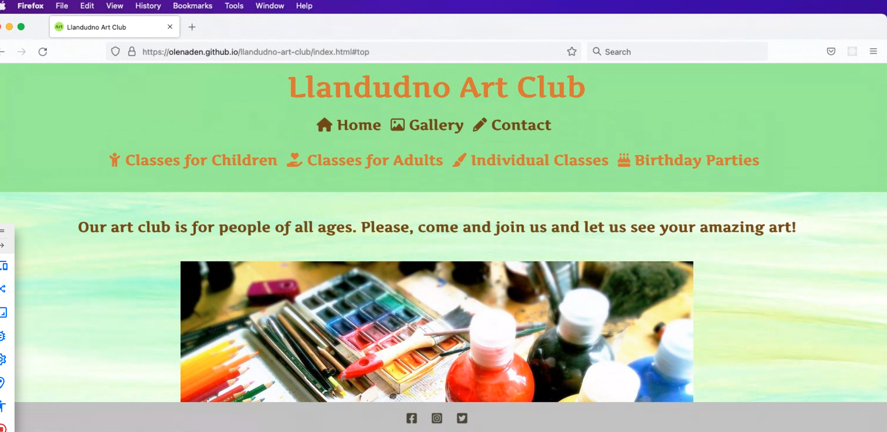
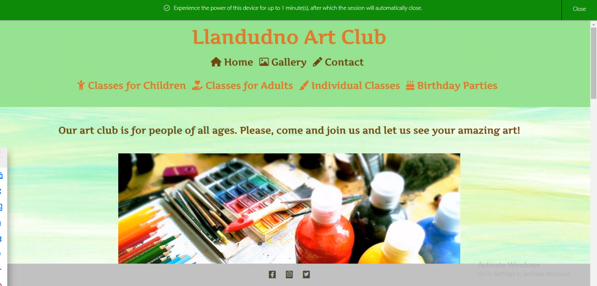

# Testing 

Relevant tests were conducted to determine the site works well. 

## Validator Testing 

### W3C Validator

The [W3C validator](https://validator.w3.org/) was used to validate the HTML on all three pages of the website. No errors or warnings were found on html pages.

The [Jigsaw W3](https://jigsaw.w3.org/css-validator/) was used to validate CSS code. All the  errors on CSS validation were related to [Font awesome](https://fontawesome.com/v6.0/icons).

- [Home Page HTML](documentation/testing/home-page-validation.png)
- [Gallery Page HTML](documentation/testing/gallery-page-validation.png)
- [Contact Page HTML](documentation/testing/form-page-validation.png)
- [CSS](documentation/testing/css-validation-home.png)

### Lighthouse Results

#### Mobile Devices





#### Desktop





## Fixed Bugs

- During the first validation through [Freeformater](https://www.freeformatter.com/html-validator.html) semantic errors were highlighted on the Gallery page and the Contact page (there were no headings within the sections). They have since been rectified.

- During the first validation through [Freeformater](https://www.freeformatter.com/html-validator.html) errors were highlighted on the Home page in regard to the map. After deleting payload="lazy" validation showed no problems.

## Unfixed Bugs

### The Lighthouse Results

- The Lighthouse results of the Performance score on the Gallery page for desktops in Chrome are not consistent. When they are low the problem is the size of the images which were already compressed several times. 

- To further improve the score of the Performance on the Lighthouse for the Gallery page on desktop a link was added in the head of html which seemed to have helped but then different low results were shown again. 

```html
<link rel="preload" as="style" href="assets/css/style.css"> 
```

### Browser Compatability Bugs

The only problem with browser compatability I have noticed is the Contact page on Yandex: the form is too wide.



## Responsiveness

### On the Mobile



### On the Tablet


### On the Desktop


## Browser Compatability

### Safari


### Opera

![Opera]documentation/testing/opera-desktop.png()

### Firefox



### Yandex



### Edge


